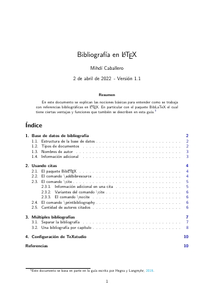
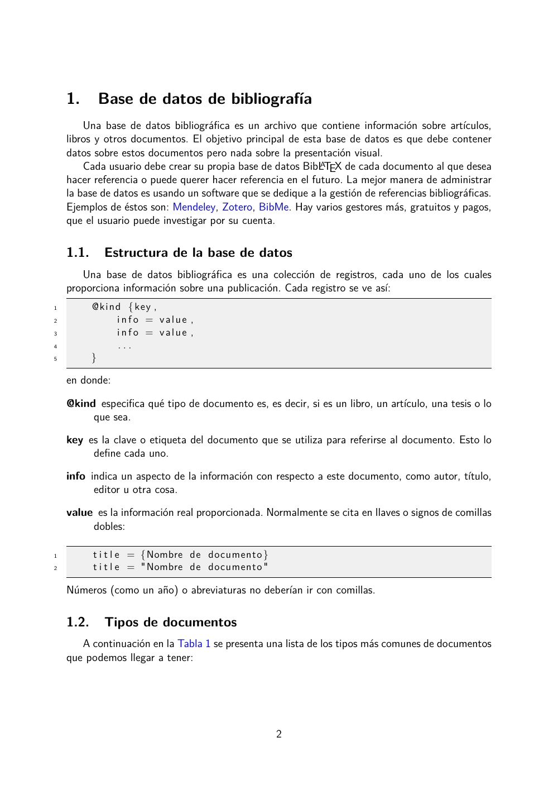

# BibLaTeX guide in Spanish
A short guide for bibliography in LaTeX. 

This document explains the basic notions to understand how to work with bibliographic references in LaTeX. Particularly with the BibLaTeX package which has certain advantages and functions that are also described in this guide.

<table>
	<tr>
		<td></td>
		<td></td>
		<td></td>
	</tr>
 </table>

**Licence**

This project is licensed under the [MIT](https://opensource.org/licenses/MIT) license.
