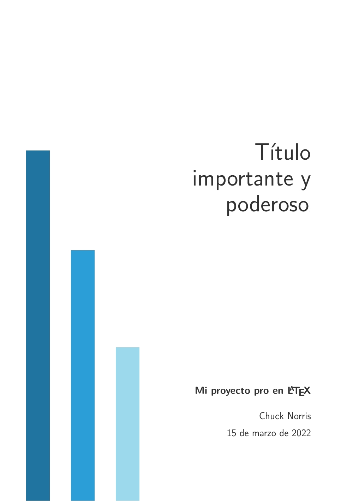
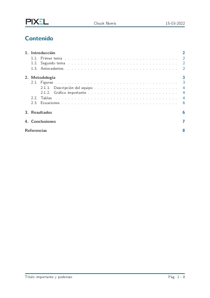
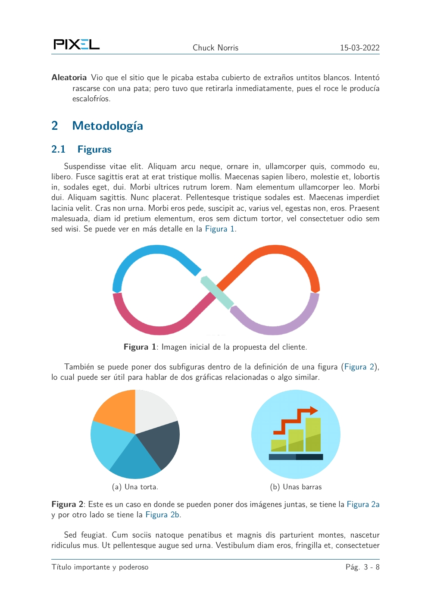
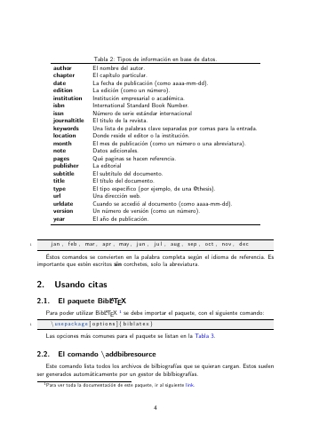

# LaTeX-Projects
LaTeX templates, classes and guides to create beautiful and efficient documents.

Author: Mihdí Caballero

## Simple report
<table>
	<tr>
		<td></td>
		<td></td>
		<td></td>
	</tr>
 </table>

## BibLaTeX guide in Spanish
<table>
	<tr>
		<td></td>
		<td></td>
		<td></td>
	</tr>
 </table>

**Learn LaTeX**

You can learn more of LaTeX in my online course, through this link: [https://bit.ly/CursoDefinitivoLateX](https://bit.ly/CursoDefinitivoLaTeX). 

**License**

This project is licensed under the [MIT](https://opensource.org/licenses/MIT) license.

