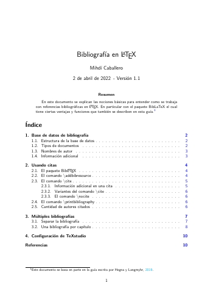
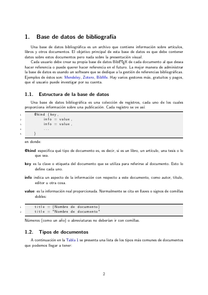

# LaTeX-Projects
LaTeX templates, classes and guides to create beautiful and efficient documents.

## Simple report
<table>
	<tr>
		<td></td>
		<td></td>
		<td></td>
	</tr>
 </table>

## BibLaTeX guide in Spanish
<table>
	<tr>
		<td></td>
		<td></td>
		<td></td>
	</tr>
 </table>

**Licence**

This project is licensed under the [MIT](https://opensource.org/licenses/MIT) license.

