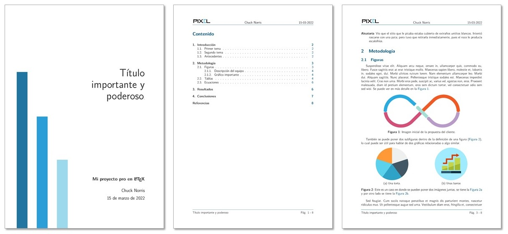

# Simple and elegant report
A beautiful and simple report template.

This template is based on the article class and is very straight forward in its coding. It is meant to be completely defined in the preamble, so the user can easily understand how the format was defined and can make changes without needing to understand the complexity of classes code in LaTeX.

The example content is there for the user to copy and paste the code of the most used elements in a report. If you want to just use the template, simple write new sections with all the LaTeX commands that you know. There are currently no special commands defined in this template. 

To-Do List:
- [x] Convert all text to lipsum snippets. 
- [x] Translate all comments to English.
- [x] Add screenshots of the final report.
- [ ] Finish README presentation.

**Licence**

This project is licensed under the [MIT](https://opensource.org/licenses/MIT) license.
